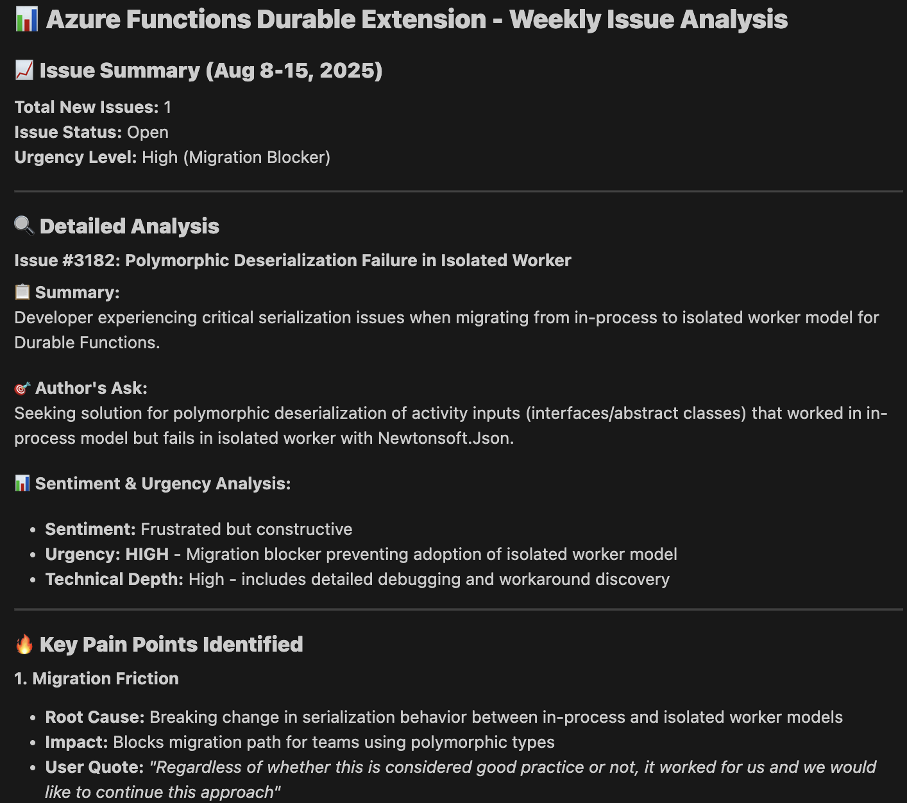
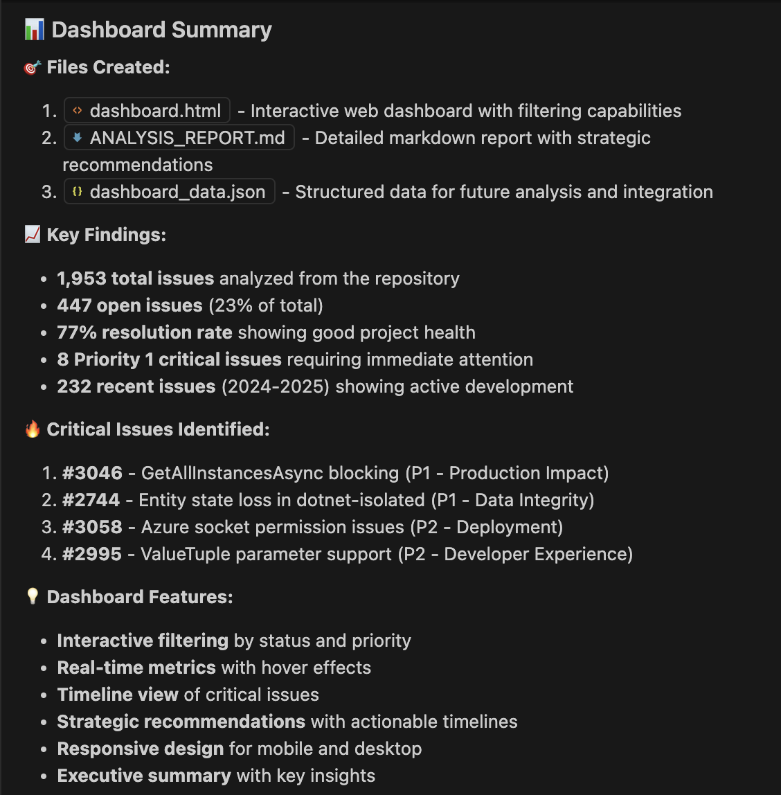
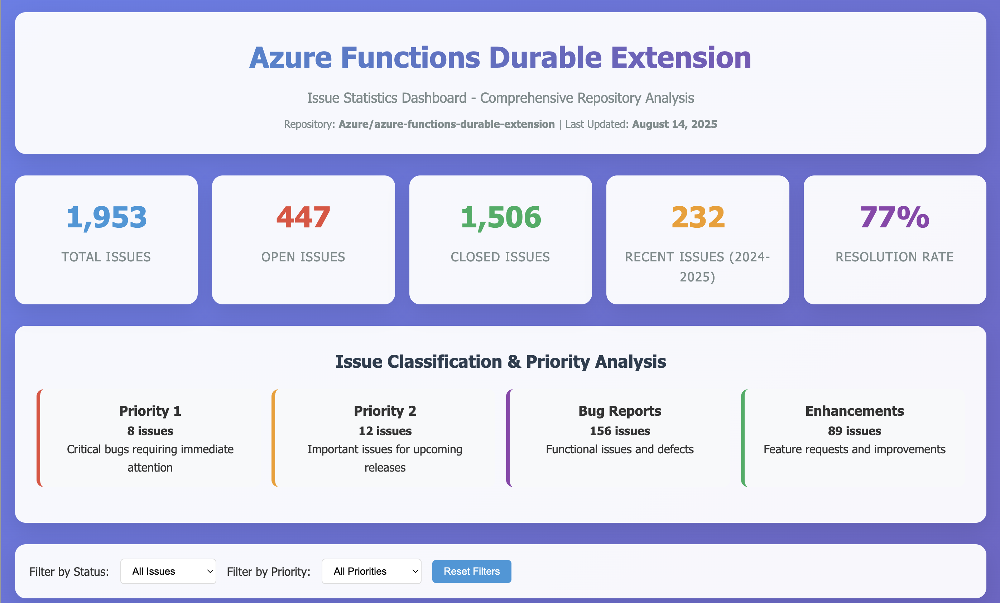

# GitHub Issue Helper Agent

This project is an agent that manages, analyzes, and addresses GitHub issues across multiple repositories. 

> [!NOTE] This project is still work in progress.

## Features
- **Manage Issues:**
  - Tag issues with existing labels based on label description
  - Tag the author to provide more details or respond to requests from repo maintainers
- **Analyze Issues:**
  - Summarize issues and the author's ask
  - Analyze sentiment and urgency
  - Dashboard with stats for issues created/closed, type, and age
- **Address Issues:**
  - Search Microsoft Learn docs for solutions
  - Search other issues in the repo for answers
  - Open draft PRs if a bug is found
- **Generate High-Level Analytics:**
  - Weekly metrics (issues created/closed, types, average age/resolution time)
  - Priority recommendations with reasoning
  - Trend analysis and historical patterns
  - Theme identification in recent issues
  - Resolution time tracking and bottleneck analysis

## How the Agent Accesses GitHub

This agent uses the GitHub MCP (Model Context Protocol) server to perform actions on GitHub repositories. The agent will:
- Use your authenticated GitHub session through the GitHub MCP server at https://api.githubcopilot.com/mcp/
- Respect the permissions of your GitHub account when performing actions
- Only perform actions on repositories where you have the necessary access levels

The agent can perform read-only analysis on any public repository, but will need your account to have write access to:
- Add or modify labels on issues
- Comment on issues or tag users
- Create draft pull requests

### Connecting to servers
This agent uses two MCP servers:
1. GitHub MCP server
2. Microsoft Learn MCP server

To connect, click _Trust_ when propmted. For the GitHub server, you'll also need to login. Click _Allow_ when prompted to authenticate to GitHub and login with your GitHub account.

## Usage Examples
Open VSCode Copilot agent mode, in the chat window, enter `/instructions` followed by your question to the agent. For example:

- "/instructions Analyze the sentiment and urgency of open issues in https://github.com/Azure/azure-functions-durable-extension"
- "/instructions Create a dashboard showing issue statistics for the https://github.com/dotnet/core repo"
- "/instructions Generate analytics for issues created in the past week for https://github.com/microsoft/TypeScript"
- "/instructions Show me priority recommendations for issues in https://github.com/Azure/azure-functions-durable-extension"
- "/instructions Analyze issue trends and identify bottlenecks in https://github.com/Azure/azure-functions-durable-python"

Or for multiple repositories:
"Summarize issue themes from these repositories: 
- https://github.com/Azure/azure-functions-durable-extension
- https://github.com/Azure/azure-functions-durable-python
- https://github.com/Azure/azure-functions-durable-js

### Example questions and result

1. _Analyzer new issues in the past week in https://github.com/Azure/azure-functions-durable-extension for insights and painpoints._

    

2. _Create a dashboard showing issue statistics for the https://github.com/Azure/azure-functions-durable-extension repo_
    
    Find the referenced files in the `examples` directory.

    

    _Dashboard_
    
